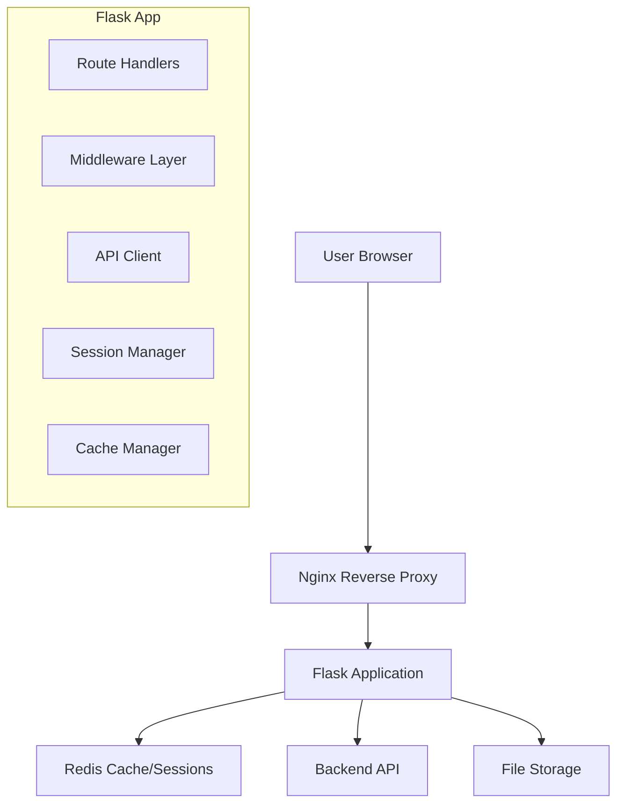

# MOSDAC AI Help Bot - Flask Frontend

A comprehensive Flask-based frontend for the MOSDAC AI Help Bot, featuring advanced middleware, multi-language support, and modern UI/UX design.

## 🚀 Features

### Core Functionality
- **Advanced Chat Interface**: Real-time chat with the MOSDAC AI assistant
- **Multi-Language Support**: 10 Indian languages + English with language-enforced responses
- **Navigation Assistance**: Step-by-step guidance for MOSDAC portal navigation
- **Voice Input/Output**: Speech recognition and text-to-speech capabilities
- **File Upload**: Support for document and image uploads
- **Feedback System**: Comprehensive rating and feedback collection

### Technical Features
- **Comprehensive Middleware**: Session management, caching, rate limiting
- **Responsive Design**: Mobile-first design with modern UI components
- **Offline Support**: Progressive Web App capabilities
- **Real-time Analytics**: User interaction tracking and performance monitoring
- **Security**: CSRF protection, secure sessions, input validation
- **Performance**: Redis caching, request optimization, lazy loading

## 📋 Requirements

### System Requirements
- Python 3.11+
- Redis 6.0+
- Node.js 16+ (for development tools)
- 2GB RAM minimum
- 10GB disk space

### Dependencies
See `requirements.txt` for complete list. Key dependencies:
- Flask 3.0.0
- Redis 5.0.1
- PyJWT 2.8.0
- Requests 2.31.0
- Gunicorn 21.2.0

## 🛠 Installation

### Local Development Setup

1. **Clone the repository**
   ```bash
   git clone <repository-url>
   cd flask_frontend
   ```

2. **Create virtual environment**
   ```bash
   python -m venv venv
   source venv/bin/activate  # On Windows: venv\Scripts\activate
   ```

3. **Install dependencies**
   ```bash
   pip install -r requirements.txt
   ```

4. **Set up environment variables**
   ```bash
   cp .env.example .env
   # Edit .env with your configuration
   ```

5. **Start Redis server**
   ```bash
   redis-server
   ```

6. **Run the application**
   ```bash
   python app.py
   ```

### Docker Setup

1. **Using Docker Compose (Recommended)**
   ```bash
   # Development
   docker-compose up -d
   
   # Production
   docker-compose --profile production up -d
   ```

2. **Manual Docker Build**
   ```bash
   docker build -t mosdac-frontend .
   docker run -p 5000:5000 mosdac-frontend
   ```

## ⚙️ Configuration

### Environment Variables

| Variable | Description | Default |
|----------|-------------|---------|
| `FLASK_ENV` | Environment (development/production) | `development` |
| `SECRET_KEY` | Flask secret key | `dev-secret-key` |
| `REDIS_URL` | Redis connection URL | `redis://localhost:6379/0` |
| `API_BASE_URL` | Backend API URL | `http://localhost:8000` |
| `LOG_LEVEL` | Logging level | `INFO` |

### Configuration Files

- `config.py`: Main configuration classes
- `.env`: Environment-specific variables
- `docker-compose.yml`: Container orchestration
- `nginx.conf`: Reverse proxy configuration

## 🏗 Architecture

### Directory Structure
```
flask_frontend/
├── app.py                 # Main Flask application
├── config.py             # Configuration settings
├── requirements.txt      # Python dependencies
├── Dockerfile           # Container configuration
├── docker-compose.yml   # Multi-container setup
├── templates/           # Jinja2 templates
│   ├── base.html       # Base template
│   ├── index.html      # Main chat interface
│   ├── admin.html      # Admin dashboard
│   └── analytics.html  # Analytics dashboard
├── static/             # Static assets
│   ├── css/           # Stylesheets
│   ├── js/            # JavaScript modules
│   └── images/        # Images and icons
└── logs/              # Application logs
```

### Component Architecture



## 🎨 Frontend Components

### JavaScript Modules

1. **api-client.js**: HTTP client with retry logic and caching
2. **chat.js**: Chat interface and message handling
3. **feedback.js**: Feedback collection and analytics
4. **navigation.js**: MOSDAC navigation assistance
5. **voice.js**: Speech recognition and synthesis
6. **main.js**: Application coordination and initialization
7. **utils.js**: Common utility functions

### CSS Architecture

1. **main.css**: Core styles and variables
2. **components.css**: UI component styles
3. **chat.css**: Chat interface styling
4. **feedback.css**: Feedback system styles
5. **responsive.css**: Mobile-responsive design

## 🔧 API Integration

### Backend Communication

The frontend communicates with the FastAPI backend through:

- **Chat API**: Real-time messaging with the AI assistant
- **Navigation API**: MOSDAC portal guidance
- **Feedback API**: User feedback collection
- **Status API**: System health monitoring
- **Admin API**: Administrative functions

### Request/Response Flow

```javascript
// Example API call
const response = await apiClient.sendMessage(message, language);
if (response.success) {
    displayMessage(response.data.response);
} else {
    handleError(response.error);
}
```

## 🌐 Multi-Language Support

### Supported Languages

- English (en)
- Hindi (hi) - हिन्दी
- Tamil (ta) - தமிழ்
- Telugu (te) - తెలుగు
- Bengali (bn) - বাংলা
- Marathi (mr) - मराठी
- Gujarati (gu) - ગુજરાતી
- Kannada (kn) - ಕನ್ನಡ
- Malayalam (ml) - മലയാളം
- Punjabi (pa) - ਪੰਜਾਬੀ

### Implementation

Language selection is handled through:
1. UI language selector
2. API parameter passing
3. Response language enforcement
4. Voice recognition language matching

## 📊 Monitoring and Analytics

### Built-in Monitoring

- **Performance Metrics**: Response times, error rates
- **User Analytics**: Interaction patterns, popular features
- **System Health**: Memory usage, cache hit rates
- **Error Tracking**: Comprehensive error logging

### External Monitoring (Optional)

- **Prometheus**: Metrics collection
- **Grafana**: Visualization dashboards
- **Fluentd**: Log aggregation

## 🔒 Security Features

### Authentication & Authorization
- Session-based authentication
- CSRF protection
- Secure cookie handling
- Rate limiting per IP/endpoint

### Data Protection
- Input validation and sanitization
- XSS prevention
- SQL injection protection
- Secure file upload handling

## 🚀 Deployment

### Production Deployment

1. **Environment Setup**
   ```bash
   export FLASK_ENV=production
   export SECRET_KEY="your-production-secret-key"
   export REDIS_URL="redis://your-redis-server:6379"
   ```

2. **Database Migration** (if using PostgreSQL)
   ```bash
   flask db upgrade
   ```

3. **Start with Gunicorn**
   ```bash
   gunicorn --bind 0.0.0.0:5000 --workers 4 app:create_app()
   ```

### Docker Deployment

```bash
# Build and deploy
docker-compose --profile production up -d

# Scale workers
docker-compose up --scale frontend=3
```

### Kubernetes Deployment

See `k8s/` directory for Kubernetes manifests:
- Deployment configuration
- Service definitions
- Ingress rules
- ConfigMaps and Secrets

## 🧪 Testing

### Running Tests

```bash
# Unit tests
pytest tests/unit/

# Integration tests
pytest tests/integration/

# End-to-end tests
pytest tests/e2e/

# Coverage report
pytest --cov=app tests/
```

### Test Categories

1. **Unit Tests**: Individual component testing
2. **Integration Tests**: API integration testing
3. **Frontend Tests**: JavaScript component testing
4. **Performance Tests**: Load and stress testing

## 📈 Performance Optimization

### Caching Strategy

- **Redis Caching**: API responses, session data
- **Browser Caching**: Static assets with versioning
- **CDN Integration**: Global content delivery

### Optimization Techniques

- **Lazy Loading**: Components loaded on demand
- **Code Splitting**: JavaScript bundle optimization
- **Image Optimization**: WebP format, responsive images
- **Compression**: Gzip/Brotli compression

## 🐛 Troubleshooting

### Common Issues

1. **Redis Connection Failed**
   ```bash
   # Check Redis status
   redis-cli ping
   
   # Restart Redis
   sudo systemctl restart redis
   ```

2. **API Connection Timeout**
   ```bash
   # Check backend API status
   curl http://localhost:8000/health
   
   # Verify network connectivity
   telnet localhost 8000
   ```

3. **Session Issues**
   ```bash
   # Clear Redis sessions
   redis-cli FLUSHDB
   
   # Check session configuration
   flask shell
   >>> from flask import session
   >>> print(app.config['SESSION_TYPE'])
   ```

### Debug Mode

Enable debug mode for development:
```bash
export FLASK_DEBUG=1
export LOG_LEVEL=DEBUG
python app.py
```

## 📚 API Documentation

### Frontend API Endpoints

| Endpoint | Method | Description |
|----------|--------|-------------|
| `/` | GET | Main chat interface |
| `/admin` | GET | Admin dashboard |
| `/analytics` | GET | Analytics dashboard |
| `/api/chat` | POST | Send chat message |
| `/api/feedback` | POST | Submit feedback |
| `/api/upload` | POST | Upload file |
| `/health` | GET | Health check |

### WebSocket Events (Future)

- `message`: Real-time chat messages
- `typing`: Typing indicators
- `status`: Connection status updates

## 🤝 Contributing

### Development Workflow

1. Fork the repository
2. Create feature branch (`git checkout -b feature/amazing-feature`)
3. Commit changes (`git commit -m 'Add amazing feature'`)
4. Push to branch (`git push origin feature/amazing-feature`)
5. Open Pull Request

### Code Standards

- **Python**: PEP 8, Black formatting
- **JavaScript**: ESLint, Prettier formatting
- **CSS**: BEM methodology, SCSS preprocessing
- **Documentation**: Comprehensive docstrings and comments

## 📄 License

This project is licensed under the MIT License - see the [LICENSE](LICENSE) file for details.

## 🙏 Acknowledgments

- **ISRO MOSDAC**: For the opportunity to develop this solution
- **SSIP 2025**: For the problem statement and guidance
- **Open Source Community**: For the amazing tools and libraries

## 📞 Support

For support and questions:

- **Email**: support@mosdac.gov.in
- **Documentation**: [Wiki](wiki-url)
- **Issues**: [GitHub Issues](issues-url)
- **Discussions**: [GitHub Discussions](discussions-url)

---

**MOSDAC AI Help Bot Flask Frontend v2.0.0**  
*Enhancing satellite data accessibility through intelligent assistance*
